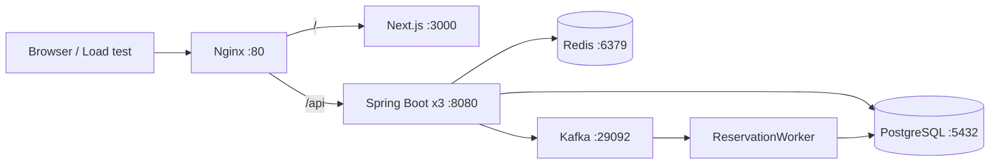

# 선착순 예약 시스템

동시에 몰리는 예약 요청에서 재고 정합성과 처리량을 비교하기 위한 풀스택 실험 프로젝트입니다. 비관적 락, 낙관적 락, Redis 분산 락을 같은 예약 API에서 선택할 수 있으며, Redis Lua와 Kafka/Outbox를 이용한 비동기 처리 구조도 개발 중입니다.

> 현재 브랜치는 Redis 선차감과 Kafka 기반 처리로 전환하는 중간 상태입니다. 실행 전에 [현재 구현 상태와 주의사항](#현재-구현-상태와-주의사항)을 확인하세요.

## 주요 기능

- 회원가입 및 BCrypt 비밀번호 암호화
- 로그인 후 24시간 유효 JWT 발급
- 상품 등록, 상품 조회, PostgreSQL/Redis 재고 동기화
- 비관적 락, 낙관적 락, Redisson 공정 분산 락 기반 예약 요청
- Redis Lua를 이용한 원자적 재고 선차감과 요청 ID 기반 중복 차감 방지
- 예약 확정, 수량 일부 반환, 예약 취소
- Kafka 예약 이벤트와 Transactional Outbox 실험
- Nginx `least_conn` 방식의 Spring Boot 인스턴스 3대 로드 밸런싱
- k6, nGrinder, JUnit 기반 동시성 및 부하 테스트

## 아키텍처



Docker Compose는 애플리케이션 3대와 프런트엔드, Nginx, PostgreSQL, Redis, Kafka, ZooKeeper를 하나의 네트워크에서 실행합니다. 외부 요청은 `http://localhost`로 받고, `/api` 요청만 백엔드 인스턴스로 전달합니다.

## 기술 스택

| 구분 | 기술 |
| --- | --- |
| Backend | Java 17, Spring Boot 4.0.1, Spring MVC, Spring Data JPA, Spring Security |
| Concurrency | JPA Pessimistic/Optimistic Lock, Redisson 3.44, Redis Lua |
| Messaging | Spring Kafka, Kafka 7.4, Transactional Outbox |
| Database | PostgreSQL 15, Redis |
| Frontend | Next.js 16.1.1, React 19.2.3, TypeScript, Tailwind CSS 4 |
| Infra | Docker Compose, Nginx |
| Test | JUnit 5, k6, nGrinder |

## 프로젝트 구조

```text
.
├── reservation_system/     # Spring Boot 백엔드
│   ├── src/main/java/      # controller, service, facade, worker, entity
│   ├── src/main/resources/ # 애플리케이션 설정과 Redis Lua 스크립트
│   └── src/test/           # 단일/다중 스레드 테스트
├── reservation_ui/         # Next.js 프런트엔드
├── tests/                  # k6 및 nGrinder 부하 테스트
├── docker-compose.yaml     # 전체 로컬 실행 환경
├── nginx.conf              # 정적 라우팅과 백엔드 로드 밸런싱
└── Dockerfile              # 독립 Nginx 이미지 정의
```

## 빠른 시작

### 사전 요구사항

- Docker 및 Docker Compose
- 사용 가능한 호스트 포트: `80`, `6379`, `9092`, `5433`, `8081`~`8083`
- ARM 환경에서는 백엔드의 `linux/amd64` 이미지가 에뮬레이션으로 실행될 수 있습니다.

### 전체 서비스 실행

```bash
docker compose up --build -d
docker compose ps
curl http://localhost/health
```

정상 실행 후 다음 주소를 사용합니다.

| 용도 | 주소 |
| --- | --- |
| 웹 UI | <http://localhost> |
| 통합 API | <http://localhost/api> |
| 개별 백엔드 | `http://localhost:8081` ~ `http://localhost:8083` |
| PostgreSQL | `localhost:5433` |
| Redis | `localhost:6379` |
| Kafka | `localhost:9092` |

로그 확인과 종료:

```bash
docker compose logs -f app1 nginx frontend
docker compose down
```

`docker compose down -v`는 PostgreSQL 볼륨까지 삭제하므로 데이터 초기화가 필요한 경우에만 사용합니다.

### 초기 데이터 준비

상품을 만든 뒤 회원가입과 로그인을 진행합니다.

```bash
curl -X POST http://localhost/api/products \
  -H 'Content-Type: application/json' \
  -d '{"name":"두쫀쿠","price":5000,"amount":500}'

curl -X POST http://localhost/api/signup \
  -H 'Content-Type: application/json' \
  -d '{
    "loginId":"tester",
    "password":"password123!",
    "email":"tester@example.com",
    "nickname":"테스터",
    "phoneNumber":"010-1234-5678"
  }'

curl -X POST http://localhost/api/login \
  -H 'Content-Type: application/json' \
  -d '{"loginId":"tester","password":"password123!"}'
```

프런트엔드는 현재 상품 ID `12`를 고정해서 조회하고 예약합니다. 새 데이터베이스에서는 ID 12 상품을 준비하거나 `reservation_ui/app/page.tsx`의 `productId`를 생성된 상품 ID로 변경해야 합니다.

## 예약 동시성 전략

예약 생성 경로는 `POST /api/reservations/{lockType}`입니다. `lockType`을 생략하면 `pessimistic`을 사용합니다.

| `lockType` | 방식 | 구현 위치 |
| --- | --- | --- |
| `pessimistic` | PostgreSQL `PESSIMISTIC_WRITE`로 해당 상품 재고 행 선점 | `StockRepository`, `ReservationService` |
| `optimistic` | `@Version` 충돌 감지 후 최대 500회, 50ms 간격 재시도 | `Stock`, `ReservationFacade` |
| `distributed` | 상품별 Redisson 공정 락, 최대 25초 대기/10초 lease | `ReservationFacade` |
| `queued-async` | Redis Lua 선차감 후 예약/Outbox 저장 및 Kafka 발행 | `ReservationCacheManager`, `ReservationService` |

예약 요청 예시:

```bash
curl -X POST http://localhost/api/reservations/pessimistic \
  -H 'Content-Type: application/json' \
  -d '{"userId":1,"productId":12,"amount":1}'
```

## API

| Method | Endpoint | 설명 | 요청/파라미터 |
| --- | --- | --- | --- |
| `POST` | `/api/signup` | 회원가입 | `loginId`, `password`, `email`, `nickname`, `phoneNumber` |
| `POST` | `/api/login` | JWT와 사용자 ID 반환 | `loginId`, `password` |
| `GET` | `/api/me` | 세션 사용자 확인용 실험 API | 없음 |
| `POST` | `/api/products` | 상품과 초기 재고 생성 | `name`, `price`, `amount` |
| `GET` | `/api/products/{id}` | 상품 및 재고 조회 | Path: `id` |
| `PATCH` | `/api/products/{id}/stock` | PostgreSQL과 Redis 재고 설정 | Query: `quantity` |
| `POST` | `/api/reservations/{lockType}` | 예약 생성, 예약 ID 반환 | `userId`, `productId`, `amount` |
| `POST` | `/api/reservations/{id}/confirm` | 예약 수량 확정 및 잔여 수량 반환 | Query: `finalAmount` |
| `POST` | `/api/reservations/{id}/cancel` | 대기 중 예약 취소 | Path: `id` |

상품 재고 변경 예시:

```bash
curl -X PATCH 'http://localhost/api/products/12/stock?quantity=500'
curl http://localhost/api/products/12
```

예약 확정과 취소:

```bash
curl -X POST 'http://localhost/api/reservations/1/confirm?finalAmount=1'
curl -X POST 'http://localhost/api/reservations/1/cancel'
```

## 테스트

### Backend 테스트

컴파일과 패키징은 외부 서비스 없이 확인할 수 있습니다.

```bash
cd reservation_system
./mvnw -DskipTests package
```

`SingleThreadTest`, `MultiThreadRequest`는 PostgreSQL, Redis, Kafka 연결을 사용하는 `@SpringBootTest`입니다. 현재 애플리케이션 설정과 `RedissonConfig`가 Docker 내부 서비스명인 `postgres`, `redis`, `kafka`를 사용하므로 호스트에서 `./mvnw test`를 바로 실행할 수 없습니다. 통합 테스트를 실행하려면 별도의 test profile로 호스트 주소를 주입할 수 있게 설정부터 분리해야 합니다.

### Frontend 검사

```bash
cd reservation_ui
npm ci
npm run lint
npm run build
```

`next/font`가 빌드 중 Geist 폰트를 Google Fonts에서 내려받으므로 프로덕션 빌드에는 외부 네트워크 연결이 필요합니다. 오프라인 빌드를 지원하려면 폰트를 저장소에 포함하고 `next/font/local`로 전환하세요.

### k6 부하 테스트

`tests/test_template.js`의 토큰, 사용자 ID, 상품 ID를 현재 데이터에 맞게 수정한 후 실행합니다. 테스트 시작 시 대상 상품의 재고를 500개로 초기화합니다.

```bash
k6 run -e TYPE=pessimistic -e VUS=10 -e ITERS=100 tests/test_template.js
k6 run -e TYPE=optimistic -e VUS=100 -e ITERS=1000 tests/test_template.js
k6 run -e TYPE=distributed -e VUS=1000 -e ITERS=2000 tests/test_template.js
```

고정 시나리오는 `tests/low_traffic.js`, `tests/mid_traffic.js`, `tests/high_traffic.js`에 있습니다. 이 파일들은 이전 API 형식과 만료된 JWT가 하드코딩되어 있으므로 실행 전에 갱신해야 합니다.

## 설정

Compose가 백엔드 컨테이너에 주입하는 주요 환경 변수입니다.

| 변수 | Compose 기본값 | 설명 |
| --- | --- | --- |
| `SERVER_PORT` | `8080` | 컨테이너 내부 백엔드 포트 |
| `SPRING_DATASOURCE_URL` | `jdbc:postgresql://postgres:5432/bakery_db` | PostgreSQL 연결 주소 |
| `SPRING_DATASOURCE_USERNAME` | `bakery_admin` | DB 사용자 |
| `SPRING_DATASOURCE_PASSWORD` | `1234` | DB 비밀번호 |
| `SPRING_JPA_HIBERNATE_DDL_AUTO` | `update` | Hibernate 스키마 정책 |
| `SPRING_DATA_REDIS_HOST` | `redis` | Redis 호스트 |
| `SPRING_KAFKA_BOOTSTRAP_SERVERS` | `kafka:29092` | Kafka 내부 주소 |

저장소의 계정 정보와 JWT 설정은 로컬 실험용입니다. 외부 배포 시 비밀번호와 JWT 서명 키를 Secret 또는 환경 변수로 분리해야 합니다.

## 현재 구현 상태와 주의사항

현재 코드는 동기식 DB 재고 차감에서 Redis/Kafka 비동기 구조로 리팩터링 중이며 다음 항목이 아직 정리되지 않았습니다.

- `ReservationService.processOrder()`의 PostgreSQL `stock.decreaseQuantity()`가 주석 처리되어 `pessimistic`, `optimistic`, `distributed` 요청은 예약을 저장해도 DB 재고를 차감하지 않습니다.
- Producer는 JSON 메시지를 발행하지만 `ReservationWorker`는 `userId:productId:amount` 문자열을 기대합니다. 현재 Worker는 발행된 메시지를 정상 처리하지 못합니다.
- Kafka `send()`의 비동기 완료를 기다리지 않고 Outbox를 `PROCESSED`로 바꾸며, `INIT`/`FAILED` 항목을 재발행하는 스케줄러는 구현되어 있지 않습니다.
- `queued-async`는 Redis 재고가 먼저 초기화되어 있어야 합니다. 상품 생성은 Redis 값을 만들지 않으므로 예약 전 재고 PATCH가 필요합니다.
- 예약 만료 시간은 저장하지만 5분 후 자동 취소하는 스케줄러는 아직 비어 있습니다.
- Spring Security는 모든 요청을 `permitAll()`로 허용하고 JWT 검증 필터가 없습니다. 현재 `Authorization` 헤더는 접근 제어에 사용되지 않습니다.
- JWT 서명 키는 애플리케이션 시작 때 임의 생성되며 재시작 후 유지되지 않습니다.
- Compose의 비밀번호, UI의 상품 ID, 부하 테스트의 토큰/사용자/상품 ID가 하드코딩되어 있습니다.
- 로컬 Next.js rewrite는 백엔드를 `localhost:8080`으로 가정하지만 백엔드의 파일 기본 포트는 `8081`입니다. 전체 Compose 실행에서는 Nginx가 `/api`를 직접 라우팅하므로 이 차이가 드러나지 않습니다.

리팩터링을 완료할 때는 재고의 단일 원천을 결정하고, Kafka 메시지 스키마 통일, Outbox relay/재시도, 요청 ID 영속화를 함께 적용해야 합니다.
